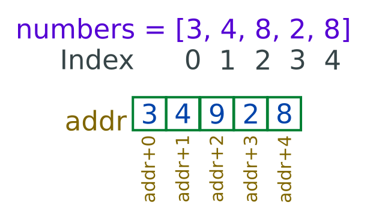

# Array in JavaScript
Массив — это специальная переменная в JavaScript, которая может содержать более одного значения. Это коллекция элементов, которые могут быть разных типов данных, таких как числа, строки, объекты и даже другие массивы. Массивы объявляются с помощью квадратных скобок [] и могут быть присвоены имени переменной. Вот пример объявления массива:

let cars = ["Mers", "BMW", "Toyoto"]

В приведенном выше примере `cars` — это массив, содержащий три элемента: "Mers", "BMW" и "Toyoto". Первый элемент в массиве всегда имеет индекс 0, второй элемент — индекс 1 и так далее. Вы можете получить доступ к элементу в массиве, обратившись к его номеру индекса.

 Например, чтобы получить доступ ко второму элементу массива `cars`, можно использовать следующий код:

let second = cars[1]

